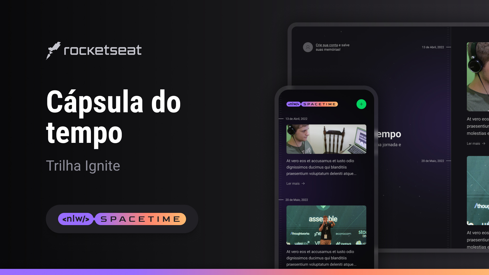

# Cápsula do Tempo || NLW Spacetime

Esta aplicação consiste em uma máquina do tempo, onde o usuário poderá guardar memórias passadas em uma linha do tempo. Esta aplicação foi construída ao longo do evento NLW Spacetime.

## Layout

Você pode visualizar o layout do projeto [clicando aqui](https://www.figma.com/file/xllhBAkuLVflqR1WB9SzTj/Capsula-do-Tempo---Trilha-Explorer?type=design&node-id=306%3A3&t=l2mqywaCaALXnqil-1).
É necessário ter uma conta no [Figma](https://www.figma.com)

## Stack utilizada

**Front-end:** Next.js, TypeScript, Tailwind CSS

**Back-end:** Node.js, TypeScript, Fastify, Prisma

**Mobile:** React Native, Expo, TypeScript, Nativewind

## Referência

- [Rocketseat](https://app.rocketseat.com.br/)

## Pojeto Final

- [WEB](https://nlw-spacetime-bice.vercel.app/)
